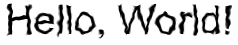
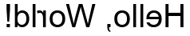

# **ImageFromTextGenerator**

## **Overview**
IFTG is a powerful Python package designed to create high-quality datasets for Optical Character Recognition (OCR) models. By generating synthetic text images with various noise and augmentation techniques, IFTG enables researchers and developers to build robust and accurate OCR systems.
        
## **Why Choose IFTG?**
IFTG simplifies and accelerates the process of generating large and diverse OCR datasets. Here’s why IFTG stands out:

- **Efficient Dataset Generation:** Quickly create extensive synthetic datasets with minimal setup and effort.

- **Rich Noise Library:** Utilize over 10 different types of noise to simulate a variety of real-world conditions.

- **Versatile Noise Combinations:** Combine multiple noise types to produce highly varied and realistic datasets.

- **Custom Noise Integration:** Add your own custom noise effects using the provided noise template for tailored dataset creation.

- **Advanced Image Augmentation:** Apply sophisticated augmentations such as rotations, blurring, and distortions to both newly generated and existing datasets.

- **Flexible Text and Font Options:** Customize text properties, including fonts, colors, sizes, and backgrounds, to fit your specific needs.
- **Support for All Languages:** Generate text images in any language with the correct font.

- **Automated Dataset Creation:** Automate the generation and saving of large datasets, improving workflow efficiency.

- **Distinctive Image Naming:** Automatically rename images to distinguish between original and augmented versions.

- **User-Friendly API:** Enjoy a simple and intuitive API design that integrates seamlessly into your projects.

## **Noises**
IFTG offers a wide variety of noise effects that you can apply to your images to create robust and diverse datasets for OCR models. With more than 10 noise types available, you have the flexibility to use static noises or introduce randomness in your noise application.

- **Static Noises:** These noises apply consistent effects, making them useful when you want repeatable results across your dataset.
  
- **Random Noises:** These noises introduce variability, allowing you to generate different effects with each image, 
enhancing the robustness of your models.
  
- **Custom Noises:** IFTG provides a [noise template](https://github.com/OmarSamirz/ImageFromTextGenerator/blob/main/noise_template.py) that allows you to easily create your own custom noise effects. This feature gives you even more control over the image augmentation process, enabling you to tailor the noises to your specific needs.

### **Examples of Noise Effects**

<table>
  <tr>
    <th>Background</th>
    <th>Blur</th>
    <th>Brightness</th>
    <th>Dilate</th>
  </tr>
  <tr>
    <td></td>
    <td></td>
    <td></td>
    <td></td>
  </tr>
</table>

<table>
  <tr>
    <th>Elastic</th>
    <th>Erode</th>
    <th>Flip</th>
    <th>Gaussian</th>
  </tr>
  <tr>
    <td></td>
    <td></td>
    <td></td>
    <td></td>
  </tr>
</table>

<table>
  <tr>
    <th>Pixel Dropout</th>
    <th>Rotation</th>
    <th>Shadow</th>
  </tr>
  <tr>
    <td></td>
    <td></td>
    <td></td>
  </tr>
</table>

## **Quick Start**
To get started with IFTG, follow these simple steps:

- **Import the Required Classes:** First, import the necessary classes from the IFTG package
```python
from iftg.generators import ImagesGenerator
from iftg.noises import RandomBlurNoise, RandomBrightnessNoise
```
    
- **generate Images:** Use the ImagesGenerator class to generate images with the desired text, font and apply noise
```python
text = ['Hello, World!']
    
results = ImagesGenerator(text=text,
                          font_path='path/to/the/font',
                          noises=[RandomBlurNoise(), RandomBrightnessNoise()],                                    
                          )
```
- **Save Images:** Finally, save the generated image and corresponding labels to the specified file
```py
results.generate_images_with_text()
```